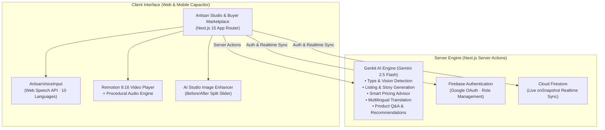
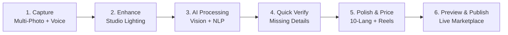

# Virasya `—` AI-Powered Heritage Marketplace

> **Smart Cataloging & Market Linkage for Marginalized Artisans** · [virasya.vercel.app](https://virasya.vercel.app/)

An AI-driven platform that acts as a *virtual business manager* for Indian artisans. It automates product photography analysis, AI image enhancement, listing generation, regional voice intake, smart pricing, multilingual translation, 9:16 social reel video generation, and marketing outreach.

---

## 🌟 Key Features & Innovations

### 1. 🎙️ Regional Voice & Multi-Photo Cataloging
- **Multilingual Voice Intake:** Artisans can describe their craft naturally by speaking in **10 Indian regional languages** (Hindi, Bengali, Marathi, Telugu, Tamil, Gujarati, Kannada, Malayalam, Punjabi, and Indian English).
- **Multi-Angle Photo Studio:** Upload 1 to 5 craft photos (front, close-up details, back, scale) with 1-click authentic sample presets.

### 2. 🪄 AI Studio Image Enhancer
- **Before/After Split Comparison:** Interactive slider to preview AI studio lighting, texture sharpening, background refinement, and artifact cleanup before listing.

### 3. 🎬 Remotion 9:16 Social Reel & Audio Engine
- **Vertical Storytelling Reels:** Instant 9:16 viral short-form video generation using `@remotion/player`.
- **Procedural Heritage Audio Engine:** Integrated Web Audio synthesis with bansuri flute, royal sitar, temple bells, and heritage lo-fi beats.
- **Localized Hooks & 1-Click Sharing:** Generates culturally tailored hooks and captions for WhatsApp and Instagram.

### 4. 💰 Dynamic Market Pricing Assistant
- **AI Price Guidance:** Evaluates craft type, raw materials, labor hours, and regional heritage value to recommend fair price ranges in INR (₹) with transparent calculation breakdowns.

### 5. 🌐 10-Language Instant Translation Pipeline
- **Seamless Regional Switcher:** Live bidirectional translation across English and 9 major Indian languages for product titles, cultural stories, materials, and care guides.

### 6. 📱 Full Mobile & Capacitor Readiness
- **Edge-to-Edge Responsive UI:** Safe-area insets (`env(safe-area-inset)`), touch-optimized controls, horizontal scrollable category strips, and custom terracotta craft scrollbars.

---

## 🏛️ System Architecture



---

## 🚀 5-Step Artisan Auto-Cataloging Workflow



1. **Multi-Image & Voice Capture:** Upload up to 5 photos and speak or type craft notes in any regional language.
2. **AI Studio Enhancer:** Clean up shadows, boost detail fidelity, and enhance color vibrancy.
3. **Multilingual AI Processing:** Genkit analyzes imagery, translates voice transcripts, and categorizes craft heritage.
4. **Quick Verification:** Confirm auto-detected dimensions, raw materials, and GI tag origins.
5. **Review & Polish:** Adjust fair pricing via the smart price advisor, translate into 10 languages with one click, and generate promotional marketing.
6. **Marketplace Publish:** Instant synchronization with live Firestore catalog and social share sheets.

---

## 🛠️ Tech Stack

| Layer | Technology | Details |
| :--- | :--- | :--- |
| **Frontend Framework** | Next.js 15 (App Router) | React 19, Turbopack, TypeScript 5 |
| **Styling & UI** | Tailwind CSS + ShadCN UI + Lucide Icons | Custom heritage theme, terracotta scrollbars |
| **AI & LLM Orchestration** | Google Genkit `^1.28` + `@genkit-ai/google-genai` | Gemini 2.5 Flash, structured Zod schemas |
| **Video & Motion Engine** | Remotion (`@remotion/player`, `@remotion/media-utils`) | 9:16 vertical video rendering & procedural audio |
| **Voice & Speech** | Web Speech API + Speech Recognition Engine | 10 regional Indian language models |
| **Authentication & Database** | Firebase Auth & Cloud Firestore | Role-based access control, live sync hooks |
| **Mobile Packaging** | Capacitor / PWA architecture | Safe-area insets, mobile touch optimization |

---

## 🤖 AI Flows (Genkit & Gemini)

All flows reside in `src/ai/flows/` as type-safe Next.js Server Actions:

| Flow File | Trigger / Purpose | Key Structured Output |
| :--- | :--- | :--- |
| `artisan-ai-type-detection.ts` | Multi-image vision analysis | `craftType`, `materials`, `suggestedTitle`, `dimensions`, `suggestedMidpoint` |
| `artisan-ai-listing-generator.ts` | Listing synthesis | `productTitle`, `description`, `seoTags[]`, `craftStory`, `culturalNote` |
| `artisan-ai-price-advisor.ts` | Smart pricing engine | `recommendedMin`, `recommendedMax`, `reasoning`, `costBreakdown` |
| `artisan-ai-craft-story-generator.ts` | Story regeneration | Fact-based cultural narrative (anti-hallucination guarantee) |
| `artisan-ai-marketing-generator.ts` | Marketing content generation | WhatsApp message, Instagram caption, viral hashtags, promo hooks |
| `translate-content-flow.ts` | Multilingual translation | Full bidirectional translation across 10 Indian languages |
| `product-qa-flow.ts` | Buyer interactive Q&A | Culturally grounded answers about materials, craft technique, and care |
| `buyer-ai-product-recommendations.ts` | Personalization | Ranked craft recommendations based on user browsing signals |

---

## 🗂️ Project Structure

```
├── public/
│   ├── crafts/                # High-res authentic sample craft photos
│   └── home-page/             # Curated hero & popular craft assets
├── src/
│   ├── ai/
│   │   ├── genkit.ts          # Genkit instance configured with Gemini 2.5 Flash
│   │   ├── dev.ts             # Dev UI registry for all flows
│   │   └── flows/             # 8 production Genkit AI flows
│   ├── app/
│   │   ├── layout.tsx         # Root layout with fonts & global styling
│   │   ├── page.tsx           # Home landing page with hero & popular crafts
│   │   ├── auth/              # Role-based sign-in & sign-up
│   │   ├── dashboard/         # Artisan hub & stats
│   │   │   └── upload/        # 5-Step interactive auto-cataloging studio
│   │   ├── marketplace/       # Buyer marketplace with filters & search
│   │   ├── product/[id]/      # Craft details, AI Q&A & Reel generator
│   │   └── purchases/         # Buyer purchase history
│   ├── components/
│   │   ├── ArtisanVoiceInput.tsx # 10-language voice recording engine
│   │   ├── ImageEnhancerStudio.tsx # Before/After AI image enhancement
│   │   ├── ProductCard.tsx    # Responsive marketplace product card
│   │   ├── ProductReelModal.tsx # Remotion video reel modal & social hub
│   │   ├── reel/              # Remotion compositions, audio synth & themes
│   │   ├── layout/            # Navbar, mobile drawers & footers
│   │   └── ui/                # Accessible Radix + Tailwind primitives
│   ├── firebase/              # Auth, Firestore hooks & rules
│   └── lib/
│       ├── curated-products.ts# Pre-seeded authentic GI-tagged crafts
│       └── types.ts           # Shared TypeScript interfaces & types
├── firestore.rules            # Firestore security rules
└── package.json
```

---

## 💻 Getting Started Locally

### 1. Prerequisites
- Node.js `18.x` or higher
- A Google AI Studio API Key ([Get one here](https://aistudio.google.com/))

### 2. Installation
```bash
git clone https://github.com/archangel2006/SIH_virasya.git
cd SIH_virasya
npm install
```

### 3. Environment Configuration
Create a `.env` file in the root directory:
```env
GEMINI_API_KEY=your_gemini_api_key_here
```

### 4. Run Development Server
```bash
npm run dev
```
Open **`http://localhost:3000`** in your browser.

### 5. Inspect AI Flows with Genkit Dev UI (Optional)
```bash
npm run genkit:dev
```
Open **`http://localhost:4000`** to test, trace, and debug AI flows in isolation.

---

## 📄 License

This project is licensed under the MIT License.
